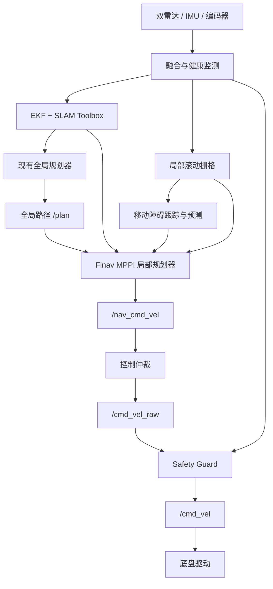

# Finav Pro 开发方案

> 分支：`dev/finav-pro`
> 定位：Jetson Orin Nano 8GB 上运行的室内双轮智能轮椅自主导航系统。

## 1. 技术结论

Finav Pro 采用“现有系统演进式重构”，不迁移到完整 Nav2，也不推倒重写。

- 保留 ROS 2、双雷达驱动、扫描融合、EKF、SLAM Toolbox、底盘驱动、控制仲裁、Web 和仿真系统。
- 保留现有 `fast2d + SE2` 全局规划，逐步补强足迹检查和模块边界。
- 使用 C++ 实现高度集成的 **Finav 原生 MPPI 局部规划器**，替换 Pure Pursuit 的主要导航控制职责。
- 新增实时局部世界模型、通用移动障碍跟踪、行为状态机和独立 Safety Guard。
- Nav2 MPPI 只作为算法与源码参考，不引入 Nav2 Controller Server、Costmap2D、行为树和生命周期框架。

## 2. 开发目标

- 在室内走廊、办公室和家居环境完成稳定自主导航。
- 对突然进入路线的行人或移动物体及时减速、停车或绕行。
- 窄通道不可安全绕行时先等待，持续阻塞后重新全局规划。
- 使用真实非对称轮椅足迹进行轨迹碰撞检查。
- 核心算法可独立替换、测试和调参，不受第三方导航框架接口限制。

暂不包含：摄像头感知、行人身份识别、密集人群导航和安全认证。

## 3. 模块处理原则

| 模块 | 决策 |
|---|---|
| 雷达、IMU、编码器和底盘驱动 | 保留，补充时间戳与健康状态 |
| EKF、TF、SLAM Toolbox | 保留，作为定位基础设施 |
| `fast2d + SE2` 全局规划 | 保留并模块化，增加精确足迹验证 |
| `nav_control.py` Pure Pursuit | 保留为基准和回退，主功能由 MPPI 替换 |
| `base_control_router.py` | 保留仲裁逻辑，输出改为 `/cmd_vel_raw` |
| 局部世界模型、MPPI、动态跟踪 | 新增 |
| Safety Guard | 新增，独立于规划器运行 |

轮椅基础足迹：前 `0.84 m`、后 `0.25 m`、左右各 `0.45 m`。最终安全边距和制动距离必须通过满载实机测试确定。

## 4. 目标架构



全局路径保留在 `map` 坐标系；MPPI 的短时预测在 `odom` 坐标系运行，避免 SLAM 位姿修正导致局部轨迹跳变；安全检查在 `base_link` 下执行。

## 5. Finav 原生 MPPI

### 输入与输出

- 输入：`/plan`、`/scan`、`/odom`、TF、雷达健康状态和动态障碍轨迹。
- 输出：`/nav_cmd_vel`、最优预测轨迹、规划状态和各 Critic 代价统计。

### 每周期流程

1. 移位复用上一周期的最优控制序列。
2. 对线速度和角速度序列批量加入高斯扰动。
3. 使用差速模型前向模拟候选轨迹。
4. 限制速度、轮速、加速度、减速度和角加速度。
5. 使用多个 Critic 计算轨迹代价。
6. 按指数权重更新控制序列并平滑。
7. 用真实足迹重新验证最终轨迹。
8. 发布第一个控制量；没有安全轨迹时发布零速度并进入等待状态。

### 第一版 Critic

- `HardCollisionCritic`：静态或实时障碍碰撞直接判为不可行。
- `DynamicCollisionCritic`：按未来相同时刻检查移动障碍冲突。
- `ClearanceCritic`：保持安全距离。
- `PathFollowCritic`、`PathProgressCritic`：跟随全局路径并持续前进。
- `HeadingCritic`、`GoalCritic`：保持合理朝向并趋近目标。
- `SmoothnessCritic`、`JerkCritic`：降低急加速、急转和乘坐冲击。
- `PreferForwardCritic`、`OscillationCritic`：抑制无必要倒车和左右摆动。

### 初始参数

| 参数 | 初始值 |
|---|---:|
| 控制频率 | 20 Hz |
| 模型步长 | 0.05 s |
| 预测步数 | 40（2.0 s） |
| 候选轨迹数 | 512，性能允许后测试 1024 |
| 导航最大线速度 | 0.5 m/s |
| 最大角速度 | 0.5 rad/s |
| 局部地图 | 8 m × 8 m |
| 局部地图分辨率 | 0.05 m |
| 动态预测时间 | 2.0 s |

第一版使用 CPU、连续预分配内存和并行循环；只有性能分析证明无法稳定达到 20–30 Hz 时才开发 CUDA 后端。

## 6. 动态障碍与行为决策

激光点先聚类，再通过帧间关联和二维卡尔曼滤波估计障碍物的位置、速度与不确定度。系统只跟踪“移动物体”，不依赖行人分类。

```text
FOLLOW_PATH
  ├─ 路径受阻且存在安全轨迹 → LOCAL_AVOID
  ├─ 没有安全轨迹           → YIELD
  ├─ 持续阻塞约 3–5 秒      → GLOBAL_REPLAN
  ├─ 障碍连续消失数帧       → FOLLOW_PATH
  └─ 雷达、定位或控制异常   → SAFE_STOP
```

短时动态障碍由 MPPI 处理，不写入永久静态地图；只有持续阻塞才生成临时全局规划障碍。

## 7. 独立安全层

Safety Guard 位于控制仲裁和底盘驱动之间，对导航、摇杆和 Web 指令统一执行：

- 多边形足迹扫掠碰撞检查。
- TTC 和实测制动距离检查。
- 雷达、里程计、TF、规划器和控制指令超时停车。
- 最大速度、角速度、加速度和减速度限制。
- 单雷达异常时限速或停车，双雷达失效时停车。
- MPPI 无解、超时、异常数值或轨迹复检失败时停车。

Safety Guard 不与 MPPI 共用同一个失效点，也不能替代物理急停和底盘制动保护。

## 8. 开发阶段

### P0：基线与测试

- 建立 rosbag 回放、移动障碍仿真和性能指标记录。
- 补齐全局规划、Pure Pursuit、足迹碰撞和控制超时测试。

### P1：Safety Guard 与局部世界模型

- 改造控制链为 `/cmd_vel_raw → Safety Guard → /cmd_vel`。
- 实现雷达健康状态、局部滚动栅格和距离场。
- 在保留 Pure Pursuit 的情况下完成静态障碍停车验证。

### P2：反应式 MPPI

- 实现差速模型、采样优化、基础 Critic 和真实足迹检查。
- 接替 Pure Pursuit，完成静态突然障碍绕行和无解停车。

### P3：动态预测

- 实现激光聚类、轨迹关联、卡尔曼滤波和时序碰撞 Critic。
- 完成横穿、同向、迎面和遮挡恢复测试。

### P4：行为与产品化

- 完成等待、恢复、持续阻塞重规划和故障降级状态机。
- 根据实机数据优化舒适性、CPU 占用和最差延迟。

## 9. 验收条件

- Orin Nano 上 MPPI 稳定运行不低于 20 Hz，最差周期不超过控制期限。
- 静态和动态障碍测试中，所有最终速度均通过独立轨迹复检。
- 窄通道无安全轨迹时停车等待，不强行绕行。
- 障碍消失后平滑恢复，不持续保留幽灵障碍或左右振荡。
- 任一关键数据源超时、规划异常或节点失效时输出零速度。
- 支持仿真、rosbag 确定性回放和实机日志复现。
- 满载、低电量和不同地面完成制动距离与安全边距标定。

## 10. 实现边界

Nav2 Humble 的 `nav2_mppi_controller` 可作为算法参考；若直接改写其 MIT 许可代码，必须保留来源和许可声明。Finav 的运行时不得依赖 Nav2 导航框架。

本方案属于非安全认证的软件导航与避障系统。载人商业化前仍需独立硬件急停、底盘制动保护、风险分析和合规验证。
