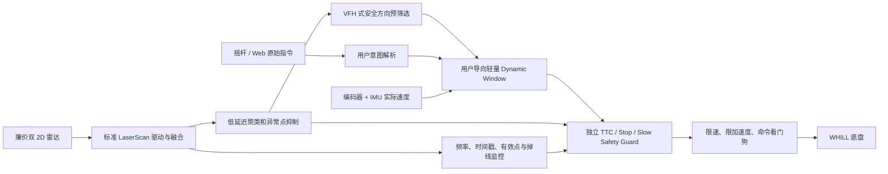

# Finav Lite 低配手动避障辅助方案

日期：2026-08-04  
开发分支：[`dev/finav-lite`](https://github.com/Flowhist/nav-2026/tree/dev/finav-lite)
基线提交：`dd9a35c6712992053ffed2cc72976eae46d2f2bb`  
目标硬件：最高不超过树莓派级别  
系统环境：ROS 2 Humble 或精简 ROS 2 运行环境、廉价双 2D 激光雷达、编码器、基础 IMU、双轮差速轮椅底盘

## 1. 方案目标

本产品线不需要建图、定位、目标点导航和全局路径规划，只在人工驾驶过程中提供实时辅助：

- 行进方向突然出现障碍时，降低线速度并通过角速度修正沿侧向安全空间绕开。
- 驾驶者意图始终是主要目标，算法只在存在碰撞风险时干预。
- 没有可靠绕行空间、雷达失效或算法异常时自动停车。
- 能在树莓派和更廉价、距离更短、稳定性更差的 2D 雷达上运行。
- 传感器品牌和型号可替换，核心算法不依赖特定雷达 SDK。

双轮差速轮椅不能真正施加横向力。本方案中的“侧向力”是指对 `(linear_x, angular_z)` 做约束修正，使车辆沿安全弧线绕过障碍。

## 2. 产品控制原则

低配方案属于 shared control，而不是自主导航。必须满足：

- 摇杆为零时，输出必须为零。
- 算法不得主动起步。
- 输出线速度绝对值不得大于驾驶者请求值。
- 不允许自动把前进改为后退，或把后退改为前进。
- 允许降低线速度，并在限定范围内增加避障角速度。
- 没有安全候选时必须停车。
- 驾驶者回中摇杆后，所有绕行方向记忆立即清除。
- 初版倒车只减速或停车，不自动绕行。
- 不因短暂单点噪声猛烈抢方向，但极近危险点仍应立即触发紧急规则。

商业智能轮椅 LUCI 将“不产生非预期运动”列为关键性能，这一原则比单纯追求绕行成功率更适合载人设备。[LUCI User Guide](https://luci.com/wp-content/uploads/2022/12/P002-013_v7.0_LUCI-User-Guide.pdf)

## 3. 当前硬件约束

从基线项目提取：

| 参数 | 当前值 |
|---|---:|
| 车体长度 | 1.09 m |
| 车体宽度 | 0.90 m |
| 旋转中心至车头 | 0.84 m |
| 旋转中心至车尾 | 0.25 m |
| 左右边界 | ±0.45 m |
| 轮距 | 0.60 m |
| 驱动线速度硬限 | 0.60 m/s |
| 驱动角速度硬限 | 0.50 rad/s |
| 当前双雷达频率 | 30 Hz |
| 当前融合输出 | 360° `/scan` |
| 雷达安装高度 | 约 0.35 m |

统一足迹：

```yaml
footprint: "[[0.84, 0.45], [0.84, -0.45], [-0.25, -0.45], [-0.25, 0.45]]"
```

即使低价雷达量程明显缩短，室内 0.6 m/s 以下的辅助避障也不需要 25 m 量程；更重要的是近场盲区、扫描频率、误点率、时间戳和左右覆盖是否可靠。

## 4. 总体架构



不引入：

- SLAM Toolbox。
- `/map`、AMCL 或全局定位。
- 全局路径规划和目标点导航。
- Nav2 Behavior Tree、Planner Server 和完整 Costmap 系统。
- 摄像头、毫米波雷达和 3D 雷达。

## 5. 核心算法

### 5.1 VFH 式方向预筛选

把当前 LaserScan 转换为极坐标障碍密度，找出车体加安全边界能够通过的连续方向区间。

它只负责回答：

- 与用户当前意图最接近的安全方向在哪里。
- 左右哪一侧有足够宽度。
- 当前是否完全没有可通过方向。

需要加入：

- 按真实车宽和距离扩张障碍角度。
- 左右绕行方向迟滞，避免每帧来回切换。
- 最小缝隙宽度检查。
- 对门口等窄通道使用速度相关安全余量。

VFH+ 是成熟且低算力的局部避障方法，并已被用于将手柄命令和自主避障渐进融合的 shared-control 实验。[VFH+ 原论文](https://www.cs.cmu.edu/~iwan/papers/vfh%2B.pdf)、[VFH+ Shared Control](https://arxiv.org/abs/2011.05228)

### 5.2 用户导向 Dynamic Window

Dynamic Window 在底盘当前可达到的 `(v, w)` 空间中采样候选控制，考虑速度和加速度约束，并对每个候选进行短时前向模拟。

建议初始规模：

| 参数 | 初始范围 |
|---|---:|
| 控制频率 | 20–30 Hz |
| 候选数量 | 60–150 |
| 模拟时域 | 1.0–1.5 s |
| 模拟步长 | 0.10 s |
| 最大线速度 | 0.60 m/s 硬限内按质量降级 |
| 最大角速度 | 0.50 rad/s 硬限内 |
| 足迹 | 真实非对称矩形 |

候选评分顺序：

1. 碰撞或无法在剩余距离内停车：硬拒绝。
2. 与用户请求 `(v_user, w_user)` 的差异。
3. 最小车体表面间距和 TTC。
4. 是否位于 VFH 预筛选的安全方向区间。
5. 与上一帧输出的变化量。
6. 是否保持上一绕行侧，减少左右振荡。

可采用以下概念代价：

```text
J = w_intent × command_error
  + w_clearance × clearance_risk
  + w_ttc × collision_time_risk
  + w_smooth × output_change
  + w_switch × avoidance_side_switch
```

只在所有硬安全约束满足后比较软代价。

Dynamic Window 原方法直接在速度空间处理机器人运动约束，适合差速底盘。[Dynamic Window Approach](https://publications.ri.cmu.edu/the-dynamic-window-approach-to-collision-avoidance)

### 5.3 为什么不使用纯人工势场

人工势场计算量最低，但容易出现：

- 正对门口或左右对称障碍时方向不稳定。
- 凹形区域局部极小。
- 墙边排斥力造成突然抢方向。
- 对差速速度和制动约束表达不足。

可以借鉴排斥力作为某个软代价，但不应作为唯一决策器。

## 6. 独立 Safety Guard

共享控制器的目标是平顺绕行，Safety Guard 的目标是即使共享控制器出错也不继续碰撞。

至少实现：

### 6.1 速度相关减速区

- 外层区域触发限速。
- 速度越高，区域前向长度越大。
- 侧向区域应考虑转弯时车头和车尾扫掠。

### 6.2 硬停止区

- 障碍进入动态停止区后立即输出零速。
- 停止区按当前实际速度、实测制动能力和总链路延迟计算。
- 若多个规则同时触发，执行最保守动作。

### 6.3 TTC Approach

根据当前速度和扫描点前向模拟车体轨迹，使预测碰撞时间不低于配置阈值。

### 6.4 故障停车

以下状态必须降速或停车：

- `/scan` 超过允许时间未更新。
- 时间戳冻结或倒退。
- 左右雷达同时或关键覆盖区域失效。
- 实际速度状态超时。
- 控制循环超时或抛出异常。
- 输出出现 NaN、Inf 或超过底盘硬限。

可借鉴 `nav2_collision_monitor` 的 Stop、Slowdown 和 Approach 模型，但低配产品最终更适合实现一个依赖更少的专用 C++ 节点。[Nav2 Humble Collision Monitor](https://github.com/ros-navigation/navigation2/tree/humble/nav2_collision_monitor)

## 7. 廉价雷达鲁棒策略

### 7.1 传感器抽象

每种雷达只负责发布：

- 标准 `sensor_msgs/LaserScan`。
- 明确且正确的时间戳和 frame。
- 扫描质量状态：频率、有效点比例、连接状态和错误计数。

避障核心不得写死 IP、串口、品牌、量程和角分辨率。

### 7.2 发现快、清除慢

- 新障碍形成最小空间聚类后立即生效。
- 障碍消失需要连续 2–3 帧确认。
- 避免廉价雷达漏点导致安全边界闪烁。

### 7.3 空间聚类而非只看最小值

- 一般停止条件要求相邻若干束或一个有效小簇命中。
- 对正前方极近单点保留紧急规则。
- 对车体自身反射和固定安装结构建立静态遮罩，但遮罩范围应最小化。

### 7.4 质量降级

建议状态机：

| 状态 | 行为 |
|---|---|
| Normal | 允许配置最高速度和完整绕行 |
| Degraded | 降低最高速度和角速度，扩大安全区 |
| Critical | 只允许极低速或仅停车 |
| Lost | 输出零速，连续有效帧后才能恢复 |

不要在传感器恢复的第一帧立即解除停车。

## 8. 初始安全距离

当前停车轮加速度配置换算后的理论线减速度约为 0.89 m/s²。暂按总延迟 0.15 s、不确定性余量 0.15 m：

```text
d_stop(v) = v × 0.15 + v² / (2 × 0.89) + 0.15
d_stop(0.6) ≈ 0.44 m
```

首轮起点：

| 边界 | 初始建议 |
|---|---:|
| 侧向舒适余量 | 车体外 0.20–0.30 m |
| 前向硬停止余量 | 0.6 m/s 时车头外约 0.45 m |
| 减速触发 | TTC 1.5–2.0 s |
| 紧急停止 | TTC 0.6–0.8 s 或进入停止区 |
| 局部模拟时域 | 1.0–1.5 s |

从 `base_link` 计算，0.6 m/s 前向硬边界初值约为 `0.84 + 0.45 = 1.29 m`。

理论推算只能用于初始测试。最终参数必须来自满载、低电量和不同地面的实测，并对最差工况增加工程余量。

## 9. 控制状态机

建议状态：

```text
IDLE
  -> PASS_THROUGH       无风险，尽量保持用户命令
  -> ASSIST             存在安全绕行方向，渐进修正
  -> SLOW               风险升高，明显降低线速度
  -> STOP               无安全轨迹或进入硬停止区
  -> SENSOR_FAULT       关键感知失效，保持零速
```

状态切换需要迟滞：

- 风险升高时快速进入更保守状态。
- 风险解除时延迟数帧逐级恢复。
- `STOP` 不能直接跳到最高速度 `PASS_THROUGH`。
- `SENSOR_FAULT` 恢复需要连续有效扫描和驾驶者重新回中确认。

## 10. 开发阶段

### Phase L0：雷达和制动基线

- 选取候选低价雷达，记录不同材质和距离的原始数据。
- 实测满载停车距离、控制延迟和雷达近场盲区。
- 建立 `/scan` 质量指标和 rosbag 回放。

### Phase L1：Safety Guard

- 实现 Stop、Slow、TTC 和故障停车。
- 暂不自动绕行，只验证安全减速和停车。
- 完成静态障碍、突然出现障碍和雷达掉线测试。

### Phase L2：共享控制 Dynamic Window

- 加入用户意图代价和可达速度采样。
- 使用真实足迹前向模拟。
- 完成单侧障碍、左右均有障碍和狭窄通道测试。

### Phase L3：VFH 方向预筛选与体验优化

- 加入缝隙检测、方向迟滞和绕行侧记忆。
- 优化墙边行驶、门口通行和干预平滑度。
- 加入可配置的辅助强度，但硬安全阈值不允许用户关闭。

### Phase L4：硬件降本与耐久

- 更换低价雷达做同一套回归测试。
- 长时间运行、单雷达掉线、低电压和高 CPU 负载测试。
- 形成每种雷达型号独立的质量与限速配置。

## 11. 验证场景

必须覆盖：

1. 正前方突然出现纸箱或移动标靶。
2. 左侧、右侧单边障碍，验证是否选择正确绕行侧。
3. 两侧均不可通过，验证是否稳定停车。
4. 门框、窄通道和桌椅腿，验证误拒绝和擦碰风险。
5. 行人左右横穿、迎面走来和斜向接近。
6. 驾驶者持续错误推向墙面，验证最大干预能力。
7. 驾驶者突然回中或反向操作，验证辅助是否立即释放。
8. 单雷达掉线、双雷达掉线、扫描频率下降和时间戳冻结。
9. 透明玻璃、黑色吸光物、软布、低矮物和悬空结构。
10. 满载、低电量和不同地面的制动。

真人测试必须放在泡沫障碍、假人、移动标靶和安全绳/急停保护测试之后。

## 12. 验收指标

- 受控测试碰撞次数为 0。
- 最小车体表面间距。
- 从风险出现到首次干预的时间。
- 最终停止距离和停止 TTC。
- 用户命令与输出命令偏差积分。
- 左右绕行方向切换次数。
- 假阳性停车率和误干预率。
- 门口和窄通道通过率。
- 20–30 Hz 控制截止时间满足率及最坏耗时。
- 雷达故障检出时间和恢复条件。
- 树莓派上的 CPU、内存、温度和降频情况。

## 13. 商业方案参照

- [3Laws Supervisor](https://3laws.io/user_doc/sources/user_guide.html)：位于期望命令与底盘之间，在危险时最小幅度修改命令，与本方案控制位置最接近。
- [LUCI](https://luci.com/wp-content/uploads/2022/12/P002-013_v7.0_LUCI-User-Guide.pdf)：强调碰撞规避和不得产生非预期运动。
- [MiR](https://mobile-industrial-robots.com/your-amr-journey/getting-started)：速度相关保护区，能绕则绕，突然进入近区则保护停车。
- [SICK warning/protective fields](https://cdn.sick.com/media/docs/7/57/957/operating_instructions_safe_robotics_area_protection_sbot_speed_en_im0077957.pdf)：外层减速、内层停车的工业安全模式。

普通低价雷达和软件 Safety Guard 可以借鉴这些行为，但不能继承其功能安全认证。

## 14. 不采用的主线方案

- 完整 Nav2：没有地图、定位和目标导航需求，依赖与调参成本过高。
- 纯 VFH+：未完整表达底盘当前速度、加速度和制动约束。
- 纯人工势场：容易产生局部极小和左右振荡。
- ORCA：需要可靠障碍速度，且普通行人不承担协同避让责任。
- TEB/MPPI：对本路线功能目标和树莓派成本而言过重。
- 强化学习：首版缺乏可解释、安全边界和分布外可靠性。

## 15. 感知与安全边界

单层 2D 雷达无法可靠检测：

- 高于或低于扫描面的障碍。
- 桌面、扶手等悬空结构。
- 台阶、楼梯和地面落差。
- 部分透明、吸光或柔软物体。
- 处于雷达遮挡区的人或物。

因此该方案属于驾驶辅助研发方案，不能仅凭软件测试宣称具备无人监督载人安全或功能安全等级。商业化需要独立硬件急停、制动链路、风险分析和合规验证。

相关标准入口：

- [ISO 7176-14:2022 电动轮椅动力与控制系统](https://www.iso.org/standard/72408.html)
- [ISO 13482:2014 个人护理机器人安全](https://www.iso.org/standard/53820.html)
