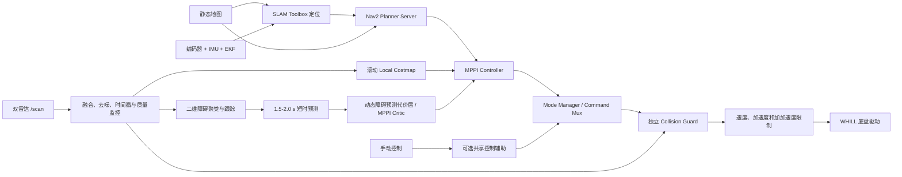

# Finav Pro 高配自主导航方案

日期：2026-08-04  
开发分支：[`dev/finav-pro`](https://github.com/Flowhist/nav-2026/tree/dev/finav-pro)
基线提交：`dd9a35c6712992053ffed2cc72976eae46d2f2bb`  
目标硬件：Jetson Orin Nano 8GB  
系统环境：ROS 2 Humble、双 2D 激光雷达、编码器、IMU、双轮差速 WHILL 轮椅底盘

## 1. 方案目标

在现有建图、定位和导航能力上，建立一套可长期扩展的完整自主导航系统，重点解决：

- 室内走廊、办公室和家居环境中的可靠导航。
- 行人等动态障碍突然进入既定路线时的及时减速、停车和绕行。
- 障碍短暂经过时不过早全局改道，持续阻塞时能够接受新路径。
- 使用真实车体足迹完成碰撞检查，避免把大型非对称轮椅近似成小圆点。
- 规划、控制、安全和故障处理分层，便于后续替换算法和产品化验证。

本方案允许对当前自研 A*、Pure Pursuit 和控制路由进行较大重构。

## 2. 当前硬件约束

从现有仓库配置提取：

| 参数 | 当前值 |
|---|---:|
| 车体长度 | 1.09 m |
| 车体宽度 | 0.90 m |
| 旋转中心至车头 | 0.84 m |
| 旋转中心至车尾 | 0.25 m |
| 左右边界 | ±0.45 m |
| 轮距 | 0.60 m |
| 驱动线速度硬限 | 0.60 m/s |
| 当前导航线速度 | 0.50 m/s |
| 驱动角速度硬限 | 0.50 rad/s |
| 双雷达频率 | 30 Hz |
| 融合扫描 | 360° `/scan` |
| 雷达安装高度 | 约 0.35 m |

统一车体足迹：

```yaml
footprint: "[[0.84, 0.45], [0.84, -0.45], [-0.25, -0.45], [-0.25, 0.45]]"
```

当前 `fast2d` 使用 0.7 m 圆形膨胀，但车头距旋转中心已经达到 0.84 m，不能覆盖完整车体及转弯扫掠区域。新系统不得继续用该近似承担碰撞安全判断。

## 3. 总体架构



核心原则：局部规划器负责“尽量绕开”，安全守卫负责“绝不能继续撞上”。二者不得合并为一个失效点。

## 4. 技术选型

### 4.1 系统框架：Nav2

建议迁移到 Nav2 的 Planner Server、Controller Server、Behavior Tree Navigator、Costmap2D、Velocity Smoother 和生命周期管理框架。

保留：

- FREE 雷达驱动和双雷达融合节点。
- `/scan` 统一接口和现有 TF 结构。
- WHILL CAN 驱动、编码器里程计、IMU 和 EKF。
- SLAM Toolbox 建图及定位链路。
- Web 后台的产品形态，但控制接口改为 Nav2 action 和明确的安全状态。

替换或重构：

- `nav_path_plan.py` 迁移到 Nav2 Planner Server。
- `nav_control.py` 由 MPPI Controller 替代。
- `base_control_router.py` 重构为模式管理和控制源仲裁，不再直接输出到底盘。
- 所有最终命令必须经过独立安全过滤节点。

### 4.2 全局规划

第一版建议使用 Nav2 Smac 2D 或 NavFn，优先完成架构迁移和动态避障闭环。等真实场景证明二维路径经常产生不可执行姿态，再评估 Smac Hybrid-A*、State Lattice 或自定义规划插件。

全局规划只处理：

- 静态地图中的墙体、家具和禁行区域。
- 持续数秒、确认不会很快消失的临时阻塞。
- 局部控制器无法继续推进时的路线级改道。

不要把每个横穿行人的整条预测轨迹永久写入全局地图。

### 4.3 局部控制：MPPI

MPPI 是本方案首选：

- 支持双轮差速模型和真实足迹碰撞检查。
- 在多个候选控制序列中前向模拟，可主动偏离全局路径绕开障碍。
- Critic 机制适合增加轮椅舒适度、离人距离和动态预测代价。
- ROS 2 Humble 已有官方实现，官方报告在较旧四代 i5 上也能达到 50 Hz 以上。

起步配置建议：

| 参数 | 初始范围 |
|---|---:|
| Controller 频率 | 20 Hz |
| Batch size | 600–1000 |
| Time steps | 40–56 |
| Model dt | 0.05 s |
| 预测时域 | 2.0–2.8 s |
| 最大线速度 | 0.50 m/s |
| 最大角速度 | 不超过底盘 0.50 rad/s 硬限 |
| Footprint checking | 开启 |
| 可视化轨迹 | 默认关闭，仅调试开启 |

先记录最坏控制周期和超时比例，再逐步增加批次，不能只看平均 CPU 占用。

参考：[Nav2 MPPI Humble](https://github.com/ros-navigation/navigation2/tree/humble/nav2_mppi_controller)

### 4.4 DWB 的定位

DWB 作为基准和回退控制器保留，用于：

- 与 MPPI 比较避障成功率、抖动和算力占用。
- MPPI 集成初期定位 costmap、TF 或底盘参数问题。
- 在算力异常或调试模式下提供较简单的控制路径。

DWB 不是最终首选，因为它通常基于当前障碍状态和常控制动作进行反应式搜索，对未来行人位置没有显式建模。

## 5. 动态障碍处理

### 5.1 第一阶段：反应式避障

首版不做人腿识别或速度预测，只完成：

- `/scan` 实时进入滚动 Local Costmap。
- ObstacleLayer 同时开启 marking 和 clearing。
- MPPI 根据当前障碍位置生成绕行轨迹。
- 独立安全层根据当前速度和激光点执行减速/停车。

这一阶段已经可以处理大多数“行人突然进入路线”的场景，并能尽早暴露足迹、雷达、TF、控制延迟和底盘执行问题。

### 5.2 第二阶段：通用二维移动目标跟踪

不建议先做语义人腿检测。雷达只有一个 0.35 m 高度扫描平面，家具腿、人腿、推车和遮挡目标很容易混淆。推荐跟踪所有可能移动的二维障碍簇：

1. 使用 jump-distance 对 `/scan` 聚类。
2. 把簇变换到 `odom` 坐标系。
3. 使用静态地图邻近匹配剔除墙体等稳定背景。
4. 使用 Hungarian 数据关联。
5. 每条轨迹使用常速度 Kalman Filter 估计 `(x, y, vx, vy)` 和协方差。
6. 连续命中约 3 帧后确认轨迹，短时遮挡期间保留预测。
7. 轨迹丢失后在约 0.3–0.8 s 内衰减清除。

静止或速度不可信的目标仍进入普通障碍层；只有稳定移动轨迹才进入预测模块。

ROS 2 Humble 可参考 [`laser_segmentation`](https://index.ros.org/r/laser_segmentation/) 的扫描分割实现，但正式产品应评估依赖维护和许可证，必要时将最小核心算法内置。

### 5.3 预测式避障

推荐预测时域为 1.5–2.0 s，采用常速度模型并随时间放大不确定性椭圆。2D 雷达遮挡严重，不适合对行人做过长的直线外推。

优先方案是在 MPPI 中增加时序动态障碍 Critic：

- 机器人候选轨迹在 `t_k` 时刻的位置，只与障碍在 `t_k` 的预测位置比较。
- 代价随预测协方差和相对速度变化。
- 碰撞区为硬拒绝，舒适距离为软代价。
- 不把整条障碍预测轨迹当成永久实心墙。

备选方案是建立带时间衰减的动态障碍 costmap 层，但普通二维 costmap 不能完整表达“同一空间、不同时间”的占用关系，效果通常不如时序 Critic。

## 6. 行人阻塞决策

推荐行为树：

1. **局部绕行**：MPPI 先在局部窗口内偏离全局路径，通过后重新靠近原路径。
2. **短暂等待**：窄走廊没有安全空间时停车约 1.5–2.5 s，等待行人通过。
3. **持久障碍确认**：同一阻塞持续存在并稳定跟踪数秒后，才进入临时全局障碍层。
4. **全局重规划**：存在替代走廊时接受新路径。
5. **无路可走**：保持停车、低频重试；任务超时后请求人工处理。

这比“每次 scan 变化都全局重规划”更稳定，也避免为一个即将离开的行人进行大范围绕路。

参考：[Nav2 PathLongerOnApproach](https://docs.nav2.org/configuration/packages/bt-plugins/decorators/PathLongerOnApproach.html)

## 7. 独立安全层

安全层位于 Command Mux 之后、底盘驱动之前，对手动和导航命令一视同仁。

至少包含：

- Stop 区域：进入后立即输出零速。
- Slowdown 区域：按风险降低最大线速度和角速度。
- TTC Approach：根据当前速度维持最小碰撞时间。
- 扫描、里程计、TF 和输入命令看门狗。
- 传感器质量下降时自动限速。
- 任何内部异常默认输出零速。

可先使用 Humble 分支的 `nav2_collision_monitor` 验证。它支持 LaserScan、polygon/circle、Stop、Slowdown 和 Approach，但属于 CPU 软件保护，不具备硬实时或安全认证。[Nav2 Humble Collision Monitor](https://github.com/ros-navigation/navigation2/tree/humble/nav2_collision_monitor)

如需商业对照，可用支持差速底盘、2D LaserScan、ARM64 和 ROS 2 Humble 的 [3Laws Supervisor](https://docs.3laws.io/en/latest/sources/getting_started.html)进行 A/B 测试，但需要评估预编译核心、授权成本和长期可控性。

## 8. 初始安全参数

当前 `acceleration_stop: 400 deg/s²` 和轮半径 0.127 m 对应理论线减速度约 0.89 m/s²。以 0.6 m/s、总延迟暂估 0.15 s、不确定性余量 0.15 m 推算：

```text
d_stop(v) = v × 0.15 + v² / (2 × 0.89) + 0.15
d_stop(0.6) ≈ 0.44 m
```

首轮参数：

| 项目 | 初始建议 |
|---|---:|
| 导航舒适余量 | 车体外 0.30–0.40 m |
| 0.6 m/s 前向硬停止余量 | 车头外约 0.45 m |
| 减速触发 | TTC 1.5–2.0 s |
| 紧急停止 | TTC 0.6–0.8 s 或进入动态停止区 |
| 行人预测时域 | 1.5–2.0 s |

0.45 m 是车头以外的余量。从 `base_link` 计算，前向硬边界约为 `0.84 + 0.45 = 1.29 m`。

所有数值必须由满载、低电量和不同地面实测替换，建议对最差工况高分位停车距离再增加至少 20% 工程余量。

## 9. 开发阶段

### Phase A0：数据基线

- 录制左右雷达、融合扫描、里程计、原始/最终控制命令和底盘故障状态。
- 实测满载停车距离、总链路延迟和雷达掉帧。
- 建立动态行人 Gazebo 场景及 rosbag 回放测试。

### Phase A1：Safety Guard

- 真实 footprint。
- Stop、Slow、TTC 和输入超时停车。
- 故障注入测试通过后，才允许继续开发绕行。

### Phase A2：Nav2 基线迁移

- 接入 Local Costmap、Planner Server、MPPI、BT Navigator 和 Velocity Smoother。
- 保留 DWB 对照组。
- 完成静态障碍和不带预测的动态横穿测试。

### Phase A3：动态跟踪与预测

- 聚类、数据关联、Kalman 跟踪和预测输出。
- 动态 MPPI Critic。
- 局部绕行、短暂等待、持久阻塞全局改道行为树。

### Phase A4：产品化加固

- 诊断、日志、参数版本管理、故障恢复和 Web 状态展示。
- 长时间耐久、不同载荷/地面和传感器故障测试。
- 根据目标市场单独开展安全与合规工作。

## 10. 验收指标

- 所有受控测试碰撞次数为 0。
- 记录车体表面到障碍的最小距离，不使用 `base_link` 点距离代替。
- 控制周期截止时间满足率和最坏耗时。
- 横穿、迎面、同向慢行和斜向接近场景成功率。
- 无空间绕行时能稳定停车，不连续左右摆动。
- 动态障碍消失后恢复时间和幽灵障碍残留时间。
- 角速度变化率、左右换向次数和急停减速度。
- 任务成功率、平均及 95 分位通行时间。
- 单雷达掉线、TF 丢失和时间戳冻结的故障检出时间。

## 11. 不采用的主线方案

- TEB：ROS 1 工程成熟，但 ROS 2 Humble 支持和动态障碍链路不适合作为新主线。
- 纯 ORCA：依赖可靠障碍速度，且包含其他代理共同避让的假设，不能直接套用于普通行人。
- Pure Pursuit/RPP：可跟踪和减速，但不能主动偏离路径完成绕行。
- 纯 D*：只能解决地图级改道，不能处理近距离运动控制。
- 强化学习：目前安全验证、可解释性和真实分布外场景成本过高。

## 12. 感知与安全边界

单层 2D 雷达无法可靠发现：

- 高于或低于扫描平面的障碍。
- 桌面、扶手等悬空结构。
- 台阶、楼梯和地面落差。
- 部分透明玻璃、黑色吸光材料和软物体。
- 被其他物体遮挡的人体部分。

因此本方案不能仅凭算法测试宣称具备无人监督载人安全或功能安全等级。商业化还需要独立制动链路、硬件急停、风险分析和合规验证。

相关标准入口：

- [ISO 7176-14:2022 电动轮椅动力与控制系统](https://www.iso.org/standard/72408.html)
- [ISO 13482:2014 个人护理机器人安全](https://www.iso.org/standard/53820.html)
